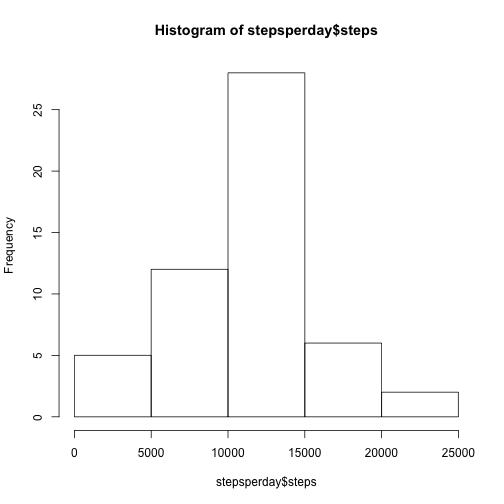
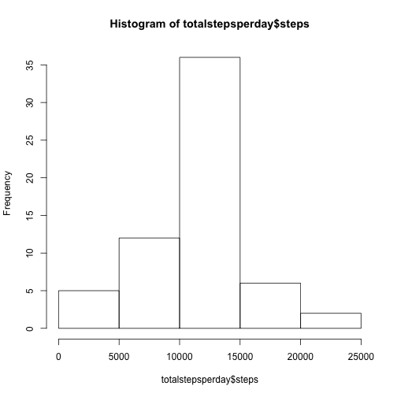

# Coursera Reproducible Research - Course Project 1

## Introduction
Course Project 1 is part of the John Hopkins Data science Specialization - Reproducible Research.
The provided dataset "activity.csv" contains activity monitoring data from a personal activity monitoring device.

The variables included in this dataset are:

* steps: The number of steps taking in a 5-minute interval
* date: The date on which the measurement was taken (as YYYY-MM-DD)
* interval: Identifier for the 5-minute interval in which a measurement was taken


## Loading and preprocessing the data
The following code reads the data from the file ""activity.csv".


```r
activity <- read.csv("activity.csv", header = TRUE, sep=",")
```

## What is mean total number of steps taken per day?
The total number of steps taken per day was calculated as follows:

```r
stepsperday <- aggregate(steps ~ date, data = activity, sum, na.rm = TRUE)
```

This is shown in the following histogram:

```r
hist(stepsperday$steps)
```



The mean and median of the total number of steps taken per day is calculated and reported as follows:

```r
mean(stepsperday$steps)
```

```
## [1] 10766.19
```

```r
median(stepsperday$steps)
```

```
## [1] 10765
```
This shows that:
* The mean of the total number of steps taken per day is 10766.
* The median of the total number of steps taken per day is 10765.


## What is the average daily activity pattern?
A time series plot of the 5-minute interval (x-axis) and the average number of steps taken, averaged across all days (y-axis) is made:

```r
avgsteps <- aggregate(steps ~ interval, data = activity, mean, na.rm = TRUE)
plot(steps ~ interval, data = avgsteps  , type = "l")
```


Which 5-minute interval, on average across all the days in the dataset, contains the maximum number of steps?

```r
max_step_interval <- avgsteps[which.max(avgsteps$steps),]
max_step_interval$interval
```

```
## [1] 835
```
The 835th interval contains the maximum number of steps.

## Imputing missing values
Calculate and report the total number of missing values in the dataset (i.e. the total number of rows with NAs):

```r
sum(is.na(activity))
```

```
## [1] 2304
```
Totally 2304 rows have missing values (NAs).

Devise a strategy for filling in all of the missing values in the dataset. The strategy does not need to be sophisticated. For example, you could use the mean/median for that day, or the mean for that 5-minute interval, etc.

Strategy for replacing NAs with the mean:
* NAs are included in column activity$steps as per starting info (2304 values to be replaced).
* Above the average steps per 5-minute was already calculated as avgsteps
* Merge  activity and avgsteps by interval
* Check which values in "activity$steps" contain "NA" and save that as "NAs"
* Create a new dataset that is equal to the original dataset but with the missing data filled in.


```r
activity <- merge(activity, avgsteps, by="interval", suffixes=c("",".avg"))
NAs <- is.na(activity$steps)
activity$steps[NAs] <- activity$steps.avg[NAs]
activitynew <- activity[,c(1:3)]
```

Make a histogram of the total number of steps taken each day

```r
totalstepsperday <- aggregate(steps ~ date, data = activitynew, sum, na.rm = TRUE)
hist(totalstepsperday$steps)
```



Calculate and report the mean and median total number of steps taken per day.

```r
mean(totalstepsperday$steps)
```

```
## [1] 10766.19
```

```r
median(totalstepsperday$steps)
```

```
## [1] 10766.19
```
This shows that:
* The mean total number of steps taken per day is 10766.
* The median total number of steps taken per day is 10766.

Do these values differ from the estimates from the first part of the assignment? What is the impact of imputing missing data on the estimates of the total daily number of steps?
The mean is the same, but the median is slightly different, which means that imputing missing data with the average steps per 5-minute interval slightly moves the median.

## Are there differences in activity patterns between weekdays and weekends?
Create a new factor variable in the dataset with two levels – “weekday” and “weekend” indicating whether a given date is a weekday or weekend day.

First, check how the column date is included in the data:

```r
str(activitynew)
```

```
## 'data.frame':	17568 obs. of  3 variables:
##  $ interval: int  0 0 0 0 0 0 0 0 0 0 ...
##  $ steps   : num  1.72 0 0 0 0 ...
##  $ date    : Factor w/ 61 levels "2012-10-01","2012-10-02",..: 1 54 28 37 55 46 20 47 38 56 ...
```
The str(activitynew)" command shows that the column "date" is not included as "Date", but as "Factor.
Therefore, we need to apply as.Date on activitynew$date before we can use the weekday() function:

```r
activitynew$day <- weekdays(as.Date(activitynew$date))
```

Convert this into a factor variable "partofweek" with two levels – “weekday” and “weekend” in the dataset activitynew::

```r
daysofweek <- c('Monday', 'Tuesday', 'Wednesday', 'Thursday', 'Friday')
activitynew$partofweek <- factor((activitynew$day %in% daysofweek), 
                                  levels=c(FALSE, TRUE), labels=c('weekend', 'weekday'))
```

Make a panel plot containing a time series plot (i.e. type = type="l") of the 5-minute interval (x-axis) and the average number of steps taken, averaged across all weekday days or weekend days (y-axis). See the README file in the GitHub repository to see an example of what this plot should look like using simulated data.

```r
dataforplot <- aggregate(steps ~ interval + partofweek, activitynew, mean)
library(lattice)
xyplot(steps ~ interval | factor(partofweek), data = dataforplot, aspect = 1/2, 
    type = "l")
```


